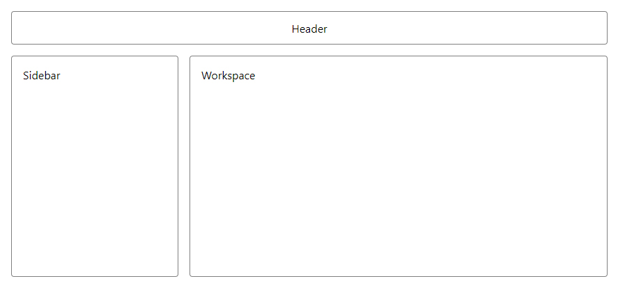

# flexout

Flexout is a minimal set of React components designed for quick prototyping of layouts using CSS flexbox model.

## Example

Create layout like this...



with a simple piece of code like this...

```
import { Row, Col } from 'flexout'
import './app.css'

export default function App() {
    return (
        <Col width={'100vw'} height={'100vh'} spacing={'1rem'} padding={'1rem'}>
            <Row className={'panel'} align={'center'} justify={'center'} height={'3rem'}>
                Header
            </Row>
            <Row flex={1} spacing={'1rem'}>
                <Col className={'panel'} width={'15rem'}>
                    Sidebar
                </Col>
                <Col className={'panel'} flex={1}>
                    Workspace
                </Col>
            </Row>
        </Col>
    )
}
```

> Note: Border in this example is added by `panel` class.

## API

The library exports 3 React components: `Flex`, `Col` and `Row`.
`Flex` is just a `div` with `display: flex`. `Col` and `Row` have their `flex-direction` set accordingly. You can set any [Flexbox CSS Property](https://developer.mozilla.org/en-US/docs/Web/CSS/CSS_Flexible_Box_Layout#reference) as a prop. All `flex-` prefixed properties have also unprefixed alias, so you can use either `flex-grow={1}` or simply `grow={1}`. For further convenience, 2 most common alignment properties have their aliases: `align` is the same as `align-items` and `justify` is the same as `justify-content`. Moreover, you can use `width`, `height`, `margin` and `padding`. All of these accepts standard CSS properties. For `margin` and `padding`, you can also use their decomposed forms as objects with optional properties `top`, `bottom`, `left` and `right`.

The package is written in TypeScript, so all interfaces are typed properly, you can't go wrong there.